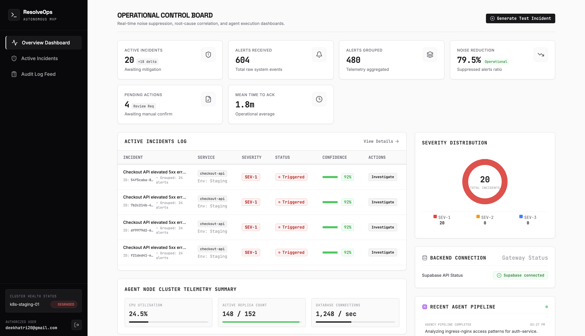

# ResolveOps

### Agentic Incident Response MVP

ResolveOps is a full-stack incident-response platform that converts alert noise into structured incidents, probable root-cause hypotheses, human-approved remediation actions, and postmortem reports.

The project demonstrates how an engineering team could move from receiving multiple infrastructure alerts to understanding and resolving an incident through a single operational workflow.

[View Live Demo](https://agentic-incident-response-mvp.vercel.app)

> Select **Explore Demo Without Saving** to experience the product without creating an account.

---

## The Problem

Modern engineering teams receive large volumes of infrastructure alerts, but only a small percentage require immediate action.

During a real incident, engineers often need to:

* Review multiple alerts
* Switch between monitoring tools
* Inspect logs and service health
* Identify recent deployments
* Form a root-cause hypothesis
* Decide whether a remediation action is safe
* Document the incident afterward

This creates alert fatigue, slows incident resolution, and increases operational pressure on on-call engineers.

ResolveOps explores how these steps can be consolidated into one structured incident-response workflow.

---

## Target Users

ResolveOps is designed for:

* Site Reliability Engineers
* Platform Engineers
* DevOps Engineers
* Engineering Managers
* Mid-sized engineering teams operating cloud-native infrastructure

The primary user is an on-call engineer responsible for investigating and resolving service incidents.

---

## Core Workflow

```text
Multiple infrastructure alerts are received
                ↓
Related alerts are grouped into one incident
                ↓
A root-cause hypothesis is generated
                ↓
Supporting evidence and alternatives are presented
                ↓
A remediation action is proposed
                ↓
The engineer approves or rejects the action
                ↓
A simulated remediation is executed
                ↓
The result is recorded in the audit trail
                ↓
A postmortem report is generated
```

---

## Key Capabilities

### Incident Management

* Persistent incident creation
* Incident severity and health tracking
* Dedicated incident detail pages
* Refresh-safe incident URLs
* User-specific incident access

### Alert Aggregation

* Twenty-four synthetic alerts generated per test incident
* Alerts grouped into one operational incident
* Alert types include:

  * HTTP 5xx errors
  * CrashLoopBackOff events
  * Readiness-probe failures
  * Missing environment configuration
  * Service degradation

### Root-Cause Hypothesis

* Probable root cause
* Confidence score
* Supporting evidence
* Alternative hypotheses
* Recommended remediation action

### Human-in-the-Loop Remediation

* Remediation proposal review
* Approve or reject decision
* Mandatory rejection reason
* Simulated action execution
* Persistent execution result
* Updated incident health status

### Audit Trail

* System actions
* Agent actions
* Human decisions
* Remediation outcomes
* Chronological incident timeline

### Postmortem Generation

* Incident summary
* Customer impact
* Detection details
* Root cause
* Resolution
* Incident timeline
* Contributing factors
* Follow-up actions

### Account and Data Security

* Supabase email and password authentication
* Email verification
* Password recovery
* Persistent sessions
* Row Level Security
* User-specific data isolation

---

## Product Screenshots

#


---

## Product Decisions and Trade-offs

### Built on Existing Incident Signals

The MVP does not attempt to replace a full observability platform. It focuses on the response workflow after alerts have been generated.

This keeps the product centred on incident understanding, decision-making, remediation, and learning.

### Deterministic Test Incidents

The current MVP uses structured synthetic incident data rather than production telemetry.

This makes the workflow safe, repeatable, and suitable for product validation without exposing customer infrastructure data.

### Human Approval Before Remediation

All remediation proposals require an explicit human decision.

The system can prepare and simulate an action, but it does not independently make irreversible infrastructure changes.

### Simulated Infrastructure Execution

Remediation is simulated rather than connected to a production Kubernetes cluster.

This validates the product workflow while avoiding the security risks associated with arbitrary infrastructure access.

### Supabase as the Managed Backend

Supabase was selected for:

* PostgreSQL data storage
* Authentication
* Row Level Security
* Managed APIs
* Fast MVP development

### Modular Persistence

Incidents, alerts, hypotheses, audit events, approvals, executions, and postmortems are stored as separate entities.

This supports auditability and future product expansion.

---

## Technology Stack

### Frontend

* React
* TypeScript
* Vite
* Responsive CSS
* Lucide icons

### Backend

* Supabase
* PostgreSQL
* Supabase Authentication
* Row Level Security

### Deployment and Version Control

* GitHub
* Vercel
* GitHub Releases

### Development Approach

* AI-assisted product development
* Incremental backend integration
* Manual workflow and security testing

---

## Data Model

The MVP currently includes:

```text
profiles
incidents
alerts
hypotheses
audit_events
action_proposals
approvals
action_executions
postmortems
```

Every user-owned record is protected through Supabase Row Level Security policies.

---

## Local Setup

### Prerequisites

* Node.js
* npm
* A Supabase project

### Installation

```bash
git clone YOUR_REPOSITORY_URL
cd agentic-incident-response-mvp
npm install
```

Create a local environment file:

```bash
cp .env.example .env.local
```

Add:

```env
VITE_SUPABASE_URL=your_supabase_project_url
VITE_SUPABASE_PUBLISHABLE_KEY=your_supabase_publishable_key
```

Start the development server:

```bash
npm run dev
```

Create a production build:

```bash
npm run build
```

---

## Current Limitations

* Uses synthetic telemetry
* Does not ingest production OpenTelemetry data
* Does not connect to Alertmanager, Datadog, or CloudWatch
* Root-cause hypotheses are currently generated from deterministic test data
* Remediation execution is simulated
* No real Kubernetes commands are executed
* No production alert correlation engine
* No enterprise SSO or team-management functionality
* Not designed for production incident-response use

---

## Future Direction

Potential future development includes:

* Alertmanager webhook ingestion
* OpenTelemetry integration
* AI-generated root-cause analysis
* Similar-incident retrieval
* Sandboxed Kubernetes remediation
* Policy-based action controls
* Slack and PagerDuty integrations
* Jira or Linear action-item creation
* Team workspaces and role management

---

## Release

Current stable release:

**ResolveOps MVP v0.1.0**

---

## Disclaimer

ResolveOps is an MVP and portfolio demonstration built using synthetic incident data and simulated remediation actions.

It is not intended for production infrastructure management, autonomous incident response, security monitoring, or real-world operational decision-making.
